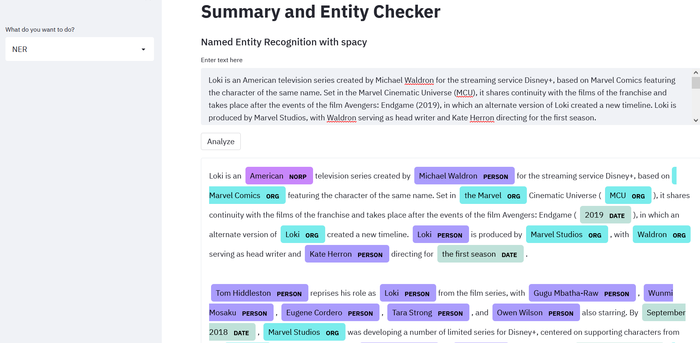
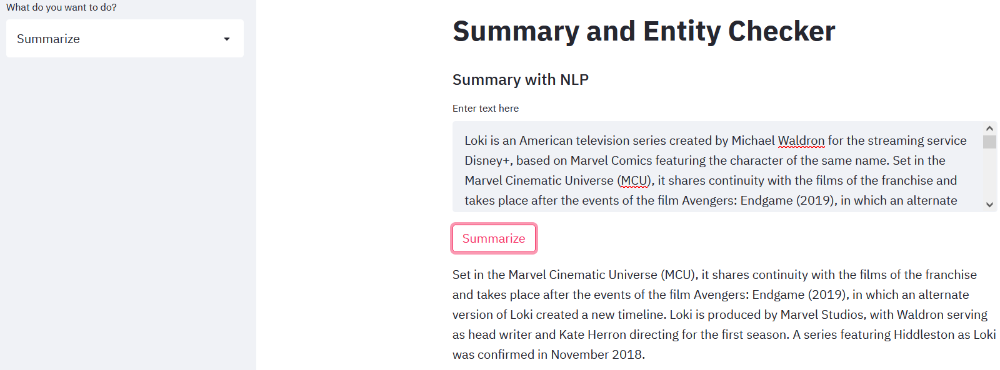

 # Summary and Entity checker web app

This is a simple streamlit app which summarizes  as well as gives named entities for a given text.
The app uses spacy for Entity Recognition

And it uses sumy, lexranksummarizer for generating summaries.

